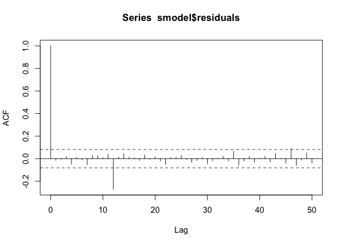
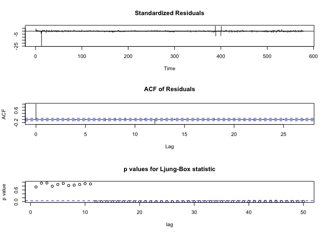

## R Markdown

This is an R Markdown document. Markdown is a simple formatting syntax
for authoring HTML, PDF, and MS Word documents. For more details on
using R Markdown see <http://rmarkdown.rstudio.com>.When you click the
**Knit** button a document will be generated that includes both content
as well as the output of any embedded R code chunks within the document.

The number of registered private cars in Sweden for the years 1977 until
February 2025, monthly data, is given in the second column of the file
`carsmon.dat` at Studium.

Find a suitable ARIMA (or SARIMA) model for these data, or a
transformation thereof. Analyze the model residuals carefully, in order
to make sure that the model provides a good description of the data.

It might be a good idea to try transformations, like the logarithm.

    #########################
    data = read.table("~/uni/analysis-time-series/regist-cars-arima/carsmon.dat", header=TRUE)
    x = log(data$count) # logarithm operation

    plot(data$count, type='l')
    title(main = "Number of registered private cars in Sweden")

    plot(x, type='l')
    title(main = "Number of registered private cars in Sweden (log)")

    par(mfrow=c(1,2)) # Making the display of 2 plots

    acf(x, lag.max = 50) # ACF
    pacf(x, lag.max = 50) # PACF cuts off after lag 1

## Differencing

Note that the `echo = FALSE` parameter was added to the code chunk to
prevent printing of the R code that generated the plot.

## Additional Seasonal Differencing

    slag = 1

    sdx = diff(dx, lag=slag)
    plot(sdx, type='l')
    title(main = paste("Number of registered private cars in Sweden diff-12, and sdiff =", slag, sep=" "))

    par(mfrow=c(1,2)) # Making the display of 2 plots

    acf(sdx, lag.max = 50) # ACF
    pacf(sdx, lag.max = 50) # PACF cuts off after lag 1

    #########################
    # Oscillations in ACF, with peak-to-peak difference of around 11-12 timesteps (months)
    # So ARIMA(11,12,0) model
    smodel=arima(dx, 
               order=c(10,0,0), 
               seasonal=list(order=c(0,0,11),period=slag)
               )

    #10 - -5401 aic
    #11 - -5581 aic

    acf(smodel$residuals, lag.max = 50) # ACF

    pacf(smodel$residuals, lag.max = 50) # PACF cuts off after lag 1

    # Histogram
    # par(mfrow=c(1,3))
    hist(smodel$residuals)

    qqnorm(smodel$residuals)

    tsdiag(smodel, gof.lag = 50) 

    summary(smodel)

    ##           Length Class  Mode     
    ## coef       22    -none- numeric  
    ## sigma2      1    -none- numeric  
    ## var.coef  484    -none- numeric  
    ## mask       22    -none- logical  
    ## loglik      1    -none- numeric  
    ## aic         1    -none- numeric  
    ## arma        7    -none- numeric  
    ## residuals 566    ts     numeric  
    ## call        4    -none- call     
    ## series      1    -none- character
    ## code        1    -none- numeric  
    ## n.cond      1    -none- numeric  
    ## nobs        1    -none- numeric  
    ## model      10    -none- list
